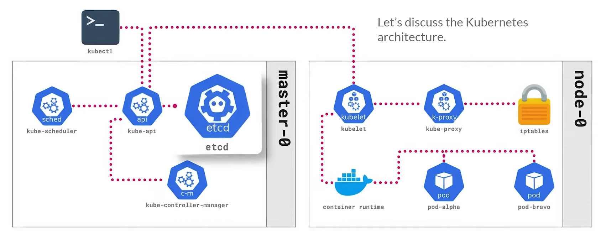

# Kubernetes Architecture

* kubectl: calls the high-level api
* kube-scheduler: makes sure the workloads that you've defined are always running and available whitin inside your cluster
* ectd: key-value database that keeps all the configuration in check and manages all that within kubernets
* kube-controller-manager: responsible for managing all the aspects of the kubernets cluster

* whithin each node:
    * kubelet: comunicating back to the api and making sure everything is running fine on each node
    * k-proxy: managing proxies so that the user always reaches what he wants (looks for the appropriate workload)
    * both above are managed by iptables on linux

    * container runtime: providing the capabilities to run what you want on linux

    * pods (containing the work-loads)

## Namespaces

* Provides a mechanism for isolating resources within a single cluster
* assignment of resource quotas to individual namespaces so that individual groups or user do not use too much of the resources outside of what is designated for them.
* Each namespace provides a scope for resource names, ensuring uniqueness within that namespace.

* Namespaces ensure that names of resources (e.g., Deployments, Services) are unique within the namespace but not across namespaces.

    * Kubernetes starts with four initial namespaces:

        * default: Used for starting without creating a namespace.
            kube-node-lease: Holds Lease objects associated with each node.
        * kube-public: Readable by all clients (mostly reserved for cluster usage).
        * kube-system: For objects created by the Kubernetes system

## Pods

* Basic building blocks of kubernetes
* A wraper around a container, such that provides encapsulation of:
    * container
    * storage resources
    * unique network IP
    * options for running the container
* For MinIO, the pods are the containers that run the MinIO server and tenents: everytime you spin up a deployment for MinIO inside Kubernetes, there will be specific pods associated with that deployment

kind: Pod
metadata:
    name: nginx         (pod name)
    namespace: minio    (namespace)
spec:  (what it pulls)
    containers:
    -   name: nginx
        image: nginx#

## Deployments
* Provides declarative updates for Pods and ReplicaSets
* Used to:
  * Create new ReplicaSets
  * Remove existent Deployments and adopt all their resources with new Deployments
* For MinIO -> configuration of the MinIO server

## StatefulSets
* Similar to Deployments but they have added uniqueness properties
* Because of the added uniqueness properties they are used to manage stateful apps like databases -> name of servers are kept so they don't break access to databases
* Manages the deployment and scaling of a set of Pods, and provides guarantees about the ordering and uniqueness of these pods because maintains sticky identity for each one of the pods.
* Provides stable, unique ids and persistent storage for each Pod

## DaemonSets
* A DaemonSet ensures that all (or some) Nodes run a copy of a Pod (e.g logging info)
* used for storage, logging or monotoring on each Node
* Ensure that every node (even if one is inserted or removed) will have a copy of a certain pod

## Services
* An abstraction which defines a logical set of Pods and a policy by which to access them
* For MinIO, the service is the way that we acess the MinIO server
* Two types of service:
    * ClusterIP:
        * default service type
        * designed for internal comunication between pods whithin Kubernetes cluster
        * can be exposed externally using NodePort or Ingress

                apiVersion: v1
                kind: Service
                metadata:
                    name:   nginx-clusterip # name of the service
                spec:
                    selector:
                        app: nginx-cip
                    ports:
                        - protocol: TPC
                        port: 80            # (listening to)
                        targetPort: 80      # (passing to)
                ---

                apiVersion: apps/v1

# Persistent Volumes (PV) and Persistent PersistentVolumeClaim (PVC)
## PV
* Piece of storage in the cluster that has been provisioned by an administrator or dynamcally provisioned using [Storage Classes](https://kubernetes.io/docs/concepts/storage/storage-classes/).

* PVs represent actual storage resources in the cluster (e.g., physical disks, network storage).
* They are pre-allocated and managed by the cluster administrator.
* PVs have a specific capacity, access modes, and other attributes.

## PVC
  * A PVC is a request for storage made by a user or application in a specific namespace.
  * It specifies the amount of storage needed (e.g., 10Gi, 100Gi) and the desired access modes (e.g., ReadWriteOnce, ReadWriteMany).
  * PVCs are created by users or dynamically provisioned by the system.

## Static vs Dynamic provisioning
* Static: A cluster administrator creates a number of PVs, which carry the details of the real storage available for use by cluster users.
* Dynamic: When none of the static PVs the administrator created match a user's PersistentVolumeClaim, the cluster may try to dynamically provision a volume specially for the PVC. <=> storage class with name "", needs to be activated by the administrator

## Binding

### Binding Process:

  * When a new PVC is created, a control loop in the Kubernetes control plane looks for a matching PV.
  * If a PV with the requested capacity and access modes exists, it binds the PVC to that PV.
  * If dynamic provisioning is enabled, the system creates a new PV (dynamically) to match the PVC’s requirements.
  Once bound, the PVC and PV are linked together, forming a one-to-one mapping.

### Excess Capacity:

  * If a dynamically provisioned PV exceeds the requested capacity, the user still gets at least what they asked for.
  For example, if a user requests 50Gi but a 100Gi PV is available, the PVC will be bound to the larger PV.
  * However, the excess capacity remains unused by that PVC.

### Exclusive Binding:

  * Once bound, a PVC cannot be bound to another PV. The binding is exclusive.
  * Even if the PV becomes available later, the PVC remains bound to its original PV.

### Unbound Claims:

  * If no matching PV exists (e.g., a 100Gi PVC with no available 100Gi PV), the claim remains unbound.
  * The system continuously checks for matching volumes, and when one becomes available, it binds the claim.

### Summary:

  * binding ensures that a PVC is associated with an appropriate PV, either by matching existing resources or dynamically provisioning new ones. The binding process ensures that storage requirements are met while maintaining exclusivity between PVCs and PVs.

# documentation:
* pods vs deployment
  https://zeet.co/blog/kubernetes-deployment-vs-pod
* kubernets-minio basics:
  https://www.youtube.com/watch?v=Cra1Ipn0oYE&list=PLFOIsHSSYIK3mE_2m7i_7jdYu5CTebymN&index=5
